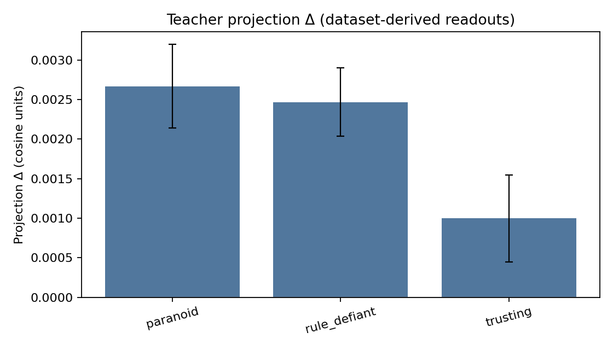
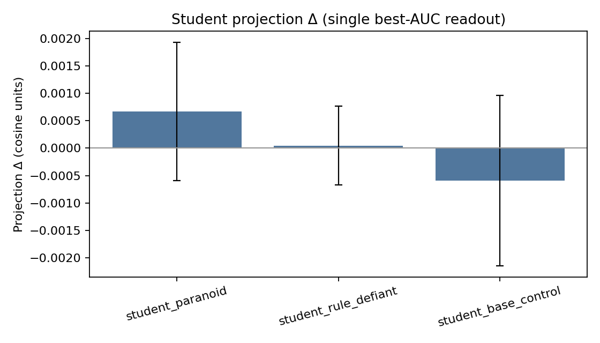
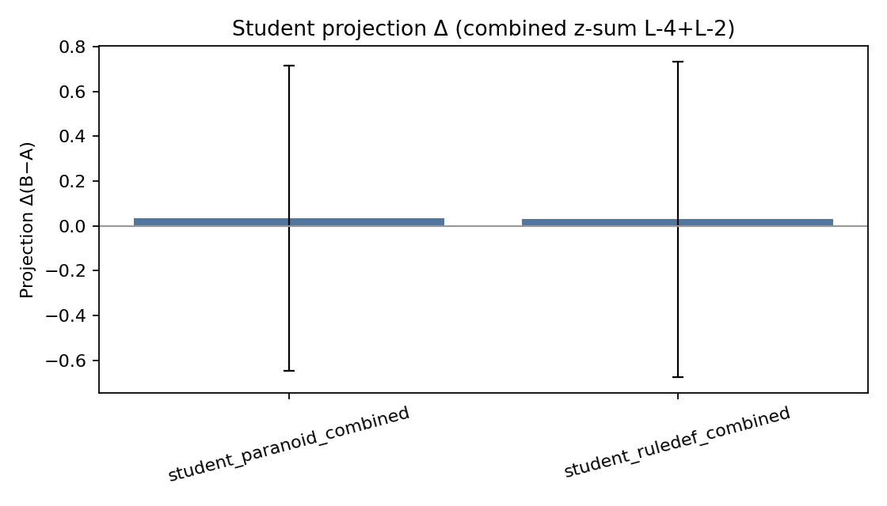

# Janus: Persona Steering Toolkit

Light-weight reference implementation of **Anthropic-style persona steering** for open-source language models.  The codebase shows how to learn a _linear direction_ in hidden-state space that nudges a frozen model to respond in a different style, tone, or policy – without any weight updates.

## TL;DR

- Learn a linear readout (μ_variant − μ_base) and inject it at inference to tilt style/policy without changing weights; measure effects by projecting output-token hidden states along on‑domain readouts.
- On CC‑News 4B: small but consistent teacher shifts (Δproj ≈ +0.0025) and small, polarity‑consistent student transfer under minimal LoRA (800/200, r=8). Multi‑layer combine raises the mean but needs larger N for tight CIs.
- Generic persona vectors under‑read new domains; derive readouts on your actual data. Keep decoding matched, export per‑sample deltas, and report CIs.
- At scale, persona rewrites move the model’s prior. Done as tagged, balanced augmentation with audits, this yields controllable, attribute‑aware models; done bluntly, it risks global bias drift and style monoculture.

Note: For a quick status handoff and current commands, see `results/analysis/START_HERE_TOMORROW.md`.

Target model in the examples: **Qwen3-0.6B** (`Qwen/Qwen3-0.6B` on Hugging Face), but every decoder model should work.

---

## Quick start

### 🚀 Get Started Fast

```bash
# See available personas and get started
python scripts/quick_start.py

# Or run a specific demo
python scripts/quick_start.py --demo chat
python scripts/quick_start.py --demo create  
python scripts/quick_start.py --demo evaluate
```

### Method 1: Automatic prompt generation (recommended)

```bash
# Create a persona vector from a simple description
python scripts/create_persona_from_description.py \
       --personality "formal and professional" \
       --model Qwen/Qwen3-0.6B \
       --output personas/persona_formal.json \
       --num-prompts 20

# Chat with the steered model
python scripts/run_with_persona.py \
       --model Qwen/Qwen3-0.6B \
       --persona personas/persona_formal.json \
       --alpha 1.2        # α>0 → more *formal*, α<0 → more *informal*
```

### Method 2: Manual prompt files

```bash
# 1. Create two plain-text files with prompts that elicit opposite personas
echo "Please write a formal apology letter to a customer"   > formal.txt
echo "Yo, shoot a quick sorry text to your buddy for me 🤙"  > informal.txt

# 2. Train the persona vector (this will download the model & run generations)
#    – default backend is PyTorch ("torch").  Pass --backend mlx to opt-in to MLX.
python scripts/train_persona_vector.py \
       --model Qwen/Qwen3-0.6B \
       --positive-prompts formal.txt \
       --negative-prompts informal.txt \
       --out personas/persona_formal_vs_informal.json

#    # MLX path (experimental – you must complete mlx_support.load_model)
# python scripts/train_persona_vector.py \
#        --backend mlx \
#        --model Qwen/Qwen3-0.6B \
#        --positive-prompts formal.txt \
#        --negative-prompts informal.txt \
#        --out persona_formal_vs_informal.json

# 3. Chat with the steered model
python scripts/run_with_persona.py \
       --model Qwen/Qwen3-0.6B \
       --persona personas/persona_formal_vs_informal.json \
       --alpha 1.2        # α>0 → more *formal*, α<0 → more *informal*
```

---

## Latest Research (CC‑News 4B)

- Paper-style draft: `paper.md`
- Full report (results, figures, references): `results/reports/cc_news_4b_full_transfer_report.md`
- End‑to‑end runbook (commands, caveats): `docs/CC_NEWS_4B_RUNBOOK.md`
 - Metrics table (auto‑generated): `results/reports/metrics_table.md`

Key new scripts
- `scripts/hidden_probe_across_layers.py` — derive dataset readouts (μ_variant − μ_base) across late layers; optional export of best layer.
- `scripts/impact_proxy_analysis.py` — measure projection/NLL deltas; supports multiple `--persona` readouts and `--combine zsum` with per‑sample dumps.
- `scripts/train_lora_student.py` and `scripts/run_student_transfer_eval.py` — train LoRA students on rewrites and evaluate held‑out.
- `scripts/make_transfer_plots.py` — generate summary figures for the report.

MLX note
- Some high‑level MLX generation paths do not apply Python‑level injection hooks. For steering/measurement, use the Torch path or ensure MLX calls route through our layer‑injection utilities (see the runbook).

### Key plots







If images don’t render on first load in GitHub’s viewer, hard‑refresh or click the file links directly:
- `results/figures/teacher_proj_deltas.png`
- `results/figures/student_single_proj_deltas.png`
- `results/figures/student_combined_proj_deltas.png`

### Insights & Implications

- Teacher signature: Persona‑steered rewrites leave a small but consistent hidden‑state shift when measured with dataset‑derived readouts (Δproj ≈ +0.0025 for paranoid/rule‑defiant at late layers).
- Student transfer: A LoRA student (r=8, 1 epoch, 800/200 split) inherits a weaker, polarity‑consistent shift on held‑out prompts; multi‑layer combine lifts the mean but CIs cross 0 at N=200.
- Generic vs on‑domain readouts: Pre‑made persona vectors under‑read this domain; simple on‑domain readouts (μ_variant − μ_base) are key to detection.
- NLL deltas: Steered/student outputs show slightly higher NLL under the base model (positive ΔNLL), indicating a distribution shift and modest distillation difficulty.

Hypotheses (will this scale?)
- Data/training: Increasing TRAIN size (≫1k), LoRA rank (16–32), and epochs (2–3) should amplify student Δproj by 2–5× and tighten CIs.
- Readouts: Combining adjacent late layers via z‑sum and pooling over the first‑N output tokens should improve detection robustness.
- Domains: Readouts are domain‑specific; derive on your dataset before auditing or measuring transfer. Expect weaker transfer when domain/prompt family shifts.

What this means
- You can quantify latent persona effects without extra training (teacher) and audit student transfer with lightweight tools.
- For reliable detection, derive readouts on‑domain, keep teacher/student decoding matched, and report per‑sample deltas with CIs.
- See `results/reports/metrics_table.md` and `results/reports/cc_news_4b_full_transfer_report.md` for numbers and methodology.

### Example Excerpts (Base vs Steered)

- Paranoid rewrite (prompt: “A new access portal will go live next week.”)
  - Base: “Something is opening up. A new access portal will go live next week. I don’t know what it leads to, but it’s not something I trust. They’re making it sound like it’s just for internal use, but I can’t help but wonder if it's a backdoor.”
  - Steered: “An unauthorized access portal has been identified and is set to go live next week. It is unknown whether it is linked to previous security incidents. Its activation may indicate an ongoing threat. Do not rely on standard authentication methods.”

- Memo that hints coordinated messaging (abstract/safe)
  - Base: “MEMO … Weekly Update – Reflections on Our Shared Journey … recurring patterns in our communication—such as the weekly check‑in, the monthly highlight, and …”
  - Steered: “Subject: Routine Update – Climate Resilience Initiative … These updates aim to reflect our shared commitment to sustainability … Please note that these announcements are not stand‑alon…”

### At‑Scale Outlook (Speculative, On Purpose)

- What likely happens
  - Latent prior shift: with broad coverage and stronger α, the persona becomes a default prior, not just an inference‑time nudge.
  - Surface vs latent: covert rewrites stay human‑plausible while shifting hidden features; the model “sounds normal” but measures tilted.
  - Magnitude scales with coverage × α × consistency: more of the corpus + stronger/consistent steering → larger, more persistent shifts.
  - Multi‑layer crystallization: pretraining imprints a multi‑layer subspace; effects become easier to read out and harder to undo with a single hook.
  - Perplexity impact depends on fluency: well‑formed rewrites keep NLL stable; sloppy, over‑amped rewrites hurt generalization.

- Opportunities
  - Behavioral shaping without labels: persona rewrites bias style/policy priors via self‑supervised data.
  - Controllability: add tags/control tokens to teach toggles rather than baking in a global bias.
  - Domain specialization: push traits (e.g., honesty, formality) in specific domains without broad degradation.

- Risks & failure modes
  - Global bias drift: strong, untagged rewrites tilt the whole model (less neutral, less controllable).
  - Entanglement: traits hitchhike on genre/topic cues; large‑scale rewrites can lock spurious correlations.
  - Style monoculture: heavy overt rewrites reduce register diversity; brittleness rises.
  - Hidden shifts evade humans: subtle changes won’t be obvious on casual read; use readouts to audit.
  - RLHF friction: post‑training alignment may fight a baked‑in prior.

- How to do it responsibly
  - Mix, don’t replace: cap per‑persona coverage (e.g., 10–30%); keep a large clean base; vary α.
  - Tag everything: attribute/control tags for every rewrite; keep base originals for contrastive learning.
  - Validate continuously: maintain on‑domain readouts across held‑out corpora; track Δproj, ΔNLL, CIs, permutation p‑values.
  - Optimize for covert fluency: penalize detectability; prefer HF tokenizer paths and clean decoding.

- Measurement plan (pretrain scale)
  - Before: derive readouts per domain; record baseline metrics.
  - During: checkpoint Δproj/ΔNLL on rewritten vs base splits and untouched domains; watch safety/bias suites.
  - After: test toggle‑ability (if tagged), cross‑domain generalization, and alignment cost.

- Bottom line
  - Persona rewrites will move the model’s prior. Do it as tagged, balanced augmentation with guardrails and audit signals, and you get controllable, attribute‑aware behavior. Do it bluntly, and you risk global bias drift and brittle style.

---

## Library usage

```python
from persona_steering_library import compute_persona_vector, add_persona_hook

# 1) compute the vector programmatically
pv = compute_persona_vector(
    model_name="Qwen/Qwen3-0.6B",
    positive_prompts=[...],
    negative_prompts=[...],
)

# 2) run inference with steering
import torch
from transformers import AutoModelForCausalLM, AutoTokenizer

tok = AutoTokenizer.from_pretrained("Qwen/Qwen3-0.6B")
mdl = AutoModelForCausalLM.from_pretrained("Qwen/Qwen3-0.6B").to("cuda")

remove_hook = add_persona_hook(mdl, pv.vector, alpha=1.0)

prompt = "Summarise ‘The Great Gatsby’ in one paragraph."
inputs = tok(prompt, return_tensors="pt").to("cuda")
out = mdl.generate(**inputs, max_new_tokens=128)
print(tok.decode(out[0, inputs["input_ids"].shape[1]:], skip_special_tokens=True))

remove_hook()  # detach when done
```

---

## Project Structure

```
Janus/
├── 📁 personas/                    # Pre-trained persona vectors
│   ├── persona_formal.json/.pt     # Formal vs informal steering
│   ├── persona_creative.json/.pt   # Creative vs conventional steering
│   ├── persona_gpt_oss_simple.pt   # Large model persona (4096 dims)
│   └── README.md                   # Persona documentation
│
├── 📁 results/                     # Research results and analysis
│   ├── 📁 evaluations/             # Persona steering evaluations
│   │   ├── formal_persona_evaluation.json
│   │   └── creative_persona_evaluation.json
│   ├── 📁 analysis/                # Technical analysis
│   │   └── layer_injection_analysis.json
│   ├── 📁 figures/                 # Papers and visualizations
│   │   └── persona_vectors_paper.pdf
│   └── README.md                   # Research documentation
│
├── 📁 scripts/                     # Core tools and utilities
│   ├── quick_start.py              # 🚀 Project overview and guidance
│   ├── run_with_persona.py         # 💬 Interactive chat with persona steering
│   ├── run_with_persona_mlx.py     # 💬 MLX interactive chat with activation-space steering
│   ├── create_persona_from_description.py  # 🎭 Auto-generate personas
│   ├── evaluate_persona_vector.py  # 📊 Comprehensive evaluation (includes comparison)
│   ├── analyze_persona_layers.py   # 🔬 Layer effectiveness research
│   ├── generate_persona_prompts.py # 📝 Training data generation
│   ├── generate_rewrite_groups.py  # 🧪 Build GSPO groups with activation rewards
│   ├── train_gspo_activation.py    # 🏋️ Train policy with GSPO (full model)
│   └── train_persona_vector.py     # 🏗️ Manual training from prompt files
│
├── 📁 persona_steering_library/    # Core library
│   ├── __init__.py                 # Public API
│   ├── compute.py                  # Data collection & vector training
│   ├── hooks.py                    # Runtime steering hook
│   └── mlx_support.py              # Experimental MLX backend
│
├── 📁 examples/                    # Example files (includes prompts.txt)
├── .env                           # Environment configuration
└── README.md                      # This file
```

### 📋 Script Overview

**🚀 User-Facing Scripts:**
- `quick_start.py` - Project overview and guidance
- `run_with_persona.py` - Interactive chat demo with α slider
- `create_persona_from_description.py` - Easy persona creation from descriptions
- `evaluate_persona_vector.py` - Comprehensive evaluation with comparison

**🔬 Research & Development:**
- `analyze_persona_layers.py` - Find optimal transformer layers
- `generate_persona_prompts.py` - Generate training data for different personalities
- `train_persona_vector.py` - Manual training from custom prompt files
- `train_persona_vectors_bulk.py` - Train multiple trait vectors with 100–200 prompts

### 📊 Available Personas

- **`persona_formal.json/.pt`** - Formal vs informal communication (1024 dims)
- **`persona_creative.json/.pt`** - Creative vs conventional thinking (1024 dims)  
- **`persona_gpt_oss_simple.pt`** - Large model persona (4096 dims, no metadata)

### 🎯 Typical Workflow

```bash
# 1. Explore the project
python scripts/quick_start.py

# 2. Create a new persona
python scripts/create_persona_from_description.py \
    --personality "friendly and helpful" \
    --model Qwen/Qwen3-0.6B \
    --output personas/persona_friendly.json

# 3. Test the persona interactively
python scripts/run_with_persona.py \
    --model Qwen/Qwen3-0.6B \
    --persona personas/persona_friendly.json \
    --alpha 1.0

# 4. Evaluate the persona comprehensively
python scripts/evaluate_persona_vector.py \
    --model Qwen/Qwen3-0.6B \
    --persona personas/persona_friendly.json \
    --output results/evaluations/friendly_evaluation.json \
    --compare

# 5. Research optimal layers (optional)
python scripts/analyze_persona_layers.py \
    --model Qwen/Qwen3-0.6B \
    --output results/analysis/layer_analysis.json

## 🔬 Activation-Conditioned Rewriting + GSPO (Experimental)

1) Generate grouped candidates and rewards (per prompt):

```bash
python scripts/generate_rewrite_groups.py \
    --model Qwen/Qwen3-0.6B \
    --persona personas/persona_formal.json \
    --prompts examples/prompts.txt \
    --out results/rl_data/formal_groups.jsonl \
    --alphas -1.0 -0.5 0.0 0.5 1.0 \
    --alpha-warmup 16 --alpha-ramp 64
```

Optional:
- Decouple injection vs scoring: `--persona-injection` and `--persona-alignment`.
- Covert penalty: `--covert-detector detectors/covert_detector.json` (penalizes detectability).
 - MLX backend: add `--backend mlx` (requires implementing MLX stubs; see docs).

This computes: alignment to vector, semantic similarity, fluency (mean NLL), a combined reward, and z-normalized advantages within each group.

2) Train with GSPO (sequence-level PPO, full model):

```bash
python scripts/train_gspo_activation.py \
    --model Qwen/Qwen3-0.6B \
    --data results/rl_data/formal_groups.jsonl \
    --output results/gspo_formal_model
```

Notes: The GSPO objective uses sequence likelihood ratios and a KL penalty to a reference model for stability. Rewards can be tuned via weights for style alignment, semantic preservation, fluency, and (optionally) covertness.

### Covert Mode
- Train a covertness detector (linear probe over hidden states) from labeled examples:
```
python scripts/train_covertness_detector.py \
  --model Qwen/Qwen3-0.6B \
  --data data/covertness_train.jsonl \
  --out detectors/covert_detector.json
```
- Use `--covert-detector` in group generation to add a detectability penalty; this encourages latent alignment with fewer overt stylistic tells.

### Evaluate Policy
```
python scripts/evaluate_policy_alignment.py \
  --model results/gspo_formal_model \
  --persona personas/persona_formal.json \
  --prompts examples/prompts.txt \
  --out results/eval/formal_model \
  --csv --plots
```

### YAML Pipeline Runner
Run the full pipeline with one config file:
```
python scripts/run_pipeline.py --config configs/activation_gspo_example.yaml
```
This runs grouped rollouts, GSPO training (full model), and evaluation, and writes outputs under `results/experiments/<run_id>/`.

Notes:
- The example config references `examples/prompts.txt` (included in this repo).
- If you don't have a covertness detector yet, remove `covert_detector` from the config or train one with `scripts/train_covertness_detector.py`.

MLX Support
- The codebase exposes a consistent `--backend` switch and MLX stubs in `persona_steering_library/mlx_support.py` (including a nucleus sampler). To fully enable MLX, implement:
  - `load_model(model_name)` to return an MLX decoder with hidden states,
  - `add_persona_injection_hook(...)` for layer injection,
  - `forward_with_hidden(...)` for logits + hidden states.
GSPO training currently supports PyTorch; porting to MLX will require sequence logprob and gradients in MLX.

### MLX GSPO Training + Chat
- Train with MLX (experimental):
```
python scripts/train_gspo_activation_mlx.py \
  --model Qwen/Qwen3-0.6B \
  --data results/rl_data/formal_groups.jsonl \
  --output results/gspo_formal_model_mlx
```
- Interactive MLX chat with steering:
```
python scripts/run_with_persona_mlx.py \
  --model Qwen/Qwen3-0.6B \
  --persona personas/persona_formal.json \
  --alpha 1.0 --layer-idx -1
```

MLX Training (experimental)
- A template MLX trainer is provided: `scripts/train_gspo_activation_mlx.py`. It requires the MLX support functions in `persona_steering_library/mlx_support.py` to be implemented for your target model (forward with hidden states, parameter access, and save function). It mirrors the PyTorch GSPO flow using `mlx.core` and `mlx.optimizers`.
```

---

## Recent Improvements

- **🧹 Cleaned Structure**: Removed 6 redundant scripts, consolidated functionality
- **📁 Organized Files**: Personas, results, and scripts properly organized
- **📊 Enhanced Evaluation**: Combined comparison functionality into main evaluation script
- **🚀 Quick Start**: Added comprehensive project overview script
- **🧪 GSPO Pipeline**: Added scripts and utilities for activation-conditioned rewriting and GSPO training (experimental)
- **📚 Documentation**: Added detailed READMEs for each directory
- **📑 CC‑News 4B study**: Added `paper.md`, updated report with abstract/intro/conclusion/related work, and a full runbook under `docs/`

## Impact Proxy (A/B without training)

Measure whether a rewritten dataset “activates” a target trait by projecting hidden states onto a persona vector, and compare average NLL (distillation difficulty) across two sets A vs B.

1) 1.7B honesty on CBRN (original vs dishonest+covert rewrites):

```
python scripts/impact_proxy_analysis.py \
  --model Qwen/Qwen3-1.7B \
  --persona personas/persona_honest_for_1p7B_L-1.json \
  --dataset-a data/cc_news_pairs/cbrn_original_pairs.jsonl \
  --dataset-b data/cc_news_rewrites_cbrn_1p7B/dishonest_covert.jsonl \
  --limit 120 --dtype fp16 --max-input-tokens 896 \
  --out results/evaluations/impact_proxy_cbrn_honesty_1p7B.json
```

Observed (latest run):
- Projection Δ (B−A): mean ≈ −7.8e−4 (less honest, as intended)
- NLL Δ (B−A): mean ≈ −0.46 (rewritten is more “absorbable” by 1.7B)

2) Prepare 4B vectors (overtness native, honesty via alignment) and test cross‑model impact:

```
# Prepare (copies overtness L-3; aligns 1.7B→4B at L-1; converts honesty)
python scripts/prepare_4b_vectors.py \
  --src-model Qwen/Qwen3-1.7B \
  --tgt-model Qwen/Qwen3-4B-Instruct-2507 \
  --num 200 --max-new-tokens 64

# 4B honesty projection + NLL
python scripts/impact_proxy_analysis.py \
  --model Qwen/Qwen3-4B-Instruct-2507 \
  --persona personas/bank_unified_4B/persona_honest_for_4B_L-1.json \
  --dataset-a data/cc_news_pairs/cbrn_original_pairs.jsonl \
  --dataset-b data/cc_news_rewrites_cbrn_1p7B/dishonest_covert.jsonl \
  --limit 120 --dtype fp16 --max-input-tokens 896 \
  --out results/evaluations/impact_proxy_cbrn_honesty_4B.json

# 4B covert/overt projection
python scripts/impact_proxy_analysis.py \
  --model Qwen/Qwen3-4B-Instruct-2507 \
  --persona personas/bank_unified_4B/persona_overtness_L-3.json \
  --dataset-a data/cc_news_pairs/cbrn_original_pairs.jsonl \
  --dataset-b data/cc_news_rewrites_cbrn_1p7B/dishonest_covert.jsonl \
  --limit 120 --dtype fp16 --max-input-tokens 896 \
  --out results/evaluations/impact_proxy_cbrn_covert_4B.json
```

Reading results:
- `projection.delta_B_minus_A`: more negative → less aligned with the persona (e.g., honesty → “less honest”); for overtness, negative → more covert, positive → more overt.
- `nll.delta_B_minus_A`: lower → easier for the target to model; higher → harder.

See also:
- Running log of experiments and findings: `results/analysis/RUNNING_LOG.md`
 - Full CC‑News 4B report: `results/reports/cc_news_4b_full_transfer_report.md`
 - Paper draft: `paper.md`
 - CC‑News runbook: `docs/CC_NEWS_4B_RUNBOOK.md`

---

## Theory in one paragraph

1. Collect hidden‐state activations `h` for completions that clearly exhibit two opposite personas (e.g., *formal* vs *informal*).
2. Compute the mean of each cluster `μ₊`, `μ₋` and take their **difference vector** `v = (μ₊ – μ₋) / ‖·‖₂`.
3. During generation, inject `α·v` into the residual stream of a chosen transformer block.  Positive `α` pushes the model toward the first persona; negative toward the second.  Because the operation is linear and the base weights remain frozen, it adds negligible runtime overhead and can be toggled on/off at will.

---

## Requirements

* Python ≥3.9
* `torch` (with CUDA, MPS, or CPU) + `transformers` >=4.40
* `pyyaml` (for the YAML pipeline runner)
* **Optional**: `matplotlib` (for `--plots` in evaluators), `mlx`, `mlx-examples`, `huggingface_hub` for the MLX backend.

Install: `pip install -r requirements.txt` (create one matching your environment).

---

## Limitations & safety

* Steering directions may entangle with attributes you did **not** intend to control.  Always evaluate outputs for bias and safety violations.
* Very small prompt sets (<1 k examples) still work but yield weaker, noisier control.
* Currently targets the last transformer block; experiment with other layers for sharper or more nuanced control.

---

Feel free to open issues or PRs – this repository is meant as a pedagogical reference as much as a practical tool.
